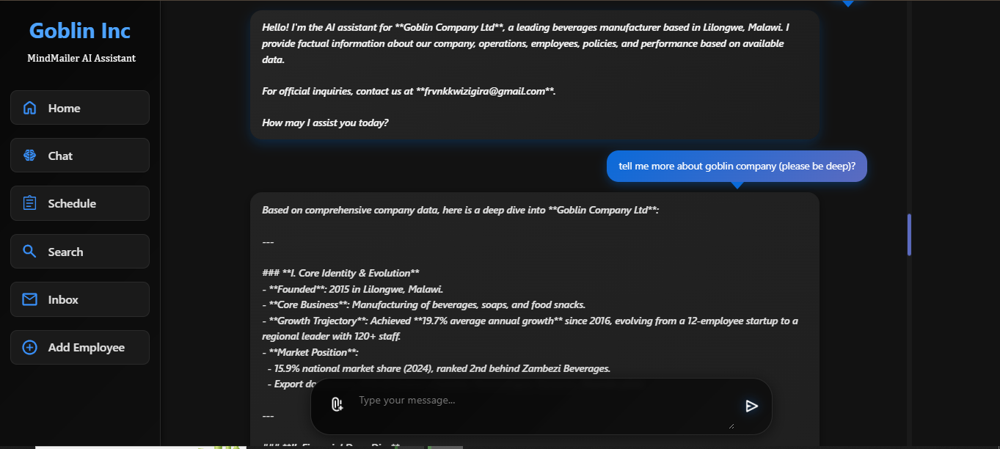

Sure! Below is the **full, professional `README.md`** code. You can copy and paste this directly into your GitHub repository’s `README.md` file.
## 📸 Chat Preview


## 📸 Home Preview


---
## 📸 Employee conversation Preview


## 📸 Add employee Preview


```markdown
# Urban Engine AI Assistant: Company Manager

A **React.js + Flask + Langchain** application designed to:

- Fetch and monitor emails from a list of users  
- Send emails to multiple recipients  
- Provide insights about your company using AI

---

## 🚀 Features

- AI-powered company insights using Langchain & OpenAI (or compatible) models  
- Gmail integration for sending and receiving emails  
- Real-time communication using Socket.IO  
- Modular backend with Flask APIs  
- React.js frontend interface

---

## 🗂️ Project Structure

```

urban-engine-ai-assistant-company-manager/
│
├── ai/                 # AI services using Langchain & OpenAI API
├── api/app/           # Flask APIs
├── notifications/     # Gmail API credentials
└── static/            # React.js frontend

````

---

## ⚙️ Setup Instructions

### 1. AI Configuration (`/ai`)

#### 📁 Create Secret Folder and `.env` File

1. Navigate to the folder:  
   `ai/utilities/`
2. Create a new folder named `Secret`
3. Inside `Secret`, create a `.env` file:  
   `ai/utilities/Secret/.env`
4. Add the following content to the `.env` file:

```env
APIKEY=your_openai_api_key
URL=https://open.bigmodel.cn/api/paas/v4
MODEL=glm-4.5
EMBEDDING=embedding-3
SMTP_HOST=smtp.gmail.com
SMTP_PORT=587
IMAP_HOST=imap.gmail.com
EMAIL_HOST=your_gmail_address
PASS=your_app_password
````

---

### 2. Gmail API Credentials (`/notifications/credentials`)

1. Visit: [Google Cloud Console](https://console.cloud.google.com/)
2. Set up your Gmail API and download the `credentials.json` file
3. Replace the placeholder file at:
   `notifications/credentials/credentials.json`
   with your actual credentials.

---

## 🧠 Backend APIs

Located in: `api/app/`

| API File             | Description                     |
| -------------------- | ------------------------------- |
| `ai_conversation.py` | AI chatbot and insights API     |
| `email_api.py`       | Email sending/receiving API     |
| `new_message_api.py` | Real-time message notifications |

### 🛠️ Start Backend

Open **three separate terminals** and run:

```bash
# Terminal 1
cd api/app
python ai_conversation.py

# Terminal 2
cd api/app
python email_api.py

# Terminal 3
cd api/app
python new_message_api.py
```

Example output:

```
* Serving Flask app 'new_message_api'
* Debug mode: on
* Running on http://127.0.0.1:4000
...
```

---

## 🌐 Frontend Usage

Located in: `static/`

### 📦 Install Dependencies

```bash
npm install socket.io-client@4.8.1
```

### ▶️ Start Frontend

```bash
cd static
npm start
```

---

## ✅ Requirements

* Python 3.8+
* Node.js 14+
* Flask
* React
* Langchain
* OpenAI API or compatible provider
* Gmail API setup (OAuth2)

---

## 📬 Notes

* This project is in active development and currently uses Flask’s development server.
  **Do not deploy to production without configuring a proper WSGI server (e.g., Gunicorn or uWSGI).**

---
 


